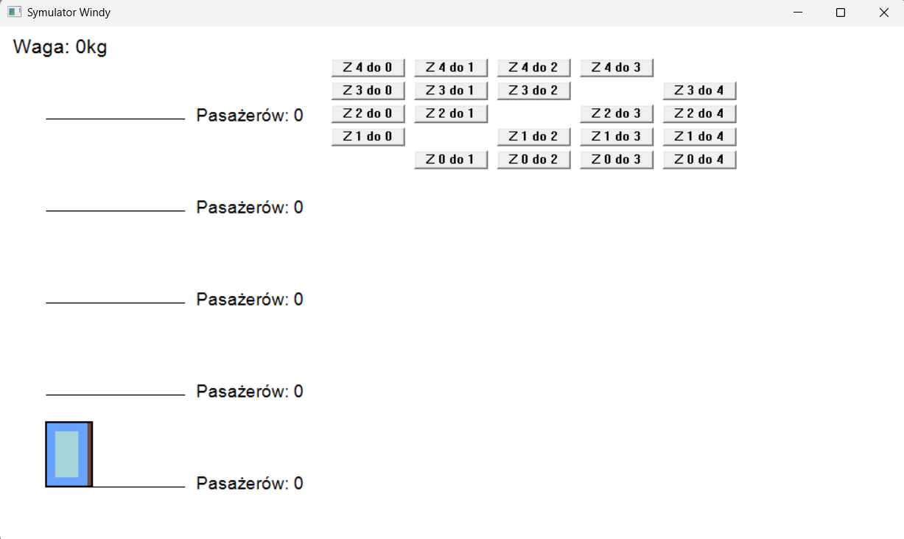

# Projekt 4 Techniki Programowania Filip Treder 203524 Błażej Kiwacz 203407

Projekt polegał na stworzeniu wizualizacji działania windy.

## Działanie projektu

1. Przyciski
    *Z (piętro) do (piętro) (dodaje pasażera na z startem na piętrze podanym i chcącego dojechać do konkretnego piętra)
2. Dodatkowe mechaniki
    * Jeśli winda jest pusta to po 5 sekundach wraca na piętro 0
        - Timer jest ustawiony na 200ms czyli 5s to 25 wywołań timera 
    * Jeśli w trakcie odliczania dodamy pasażera na którymś z pięter to odliczanie się resetuje
    * Podczas całego działania programu wyświetla nam się pole na którym mamy zapisaną aktualną wagę
    * Program automatycznie przelicza ile osób może wejść żeby waga nie przekroczyła 600kg (funkcja w kodzie canEnter())
    * Przy każdym z pięter mamy napis ile osób czeka na danym piętrze na windę nie ma podane gdzie jadą ale z ruchów windy można zauważyć że działa ona poprawnie
    * Przy użyciu zmiennej bool moving zrobione jest tak aby ekran nie migał cały czas przerysowywując okno tylko wtedy kiedy winda naprawdę się rusza
    

## Zdjęcie interfejsu

